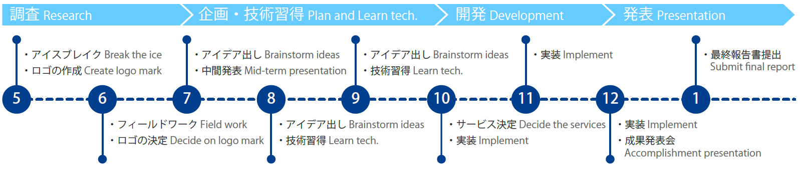
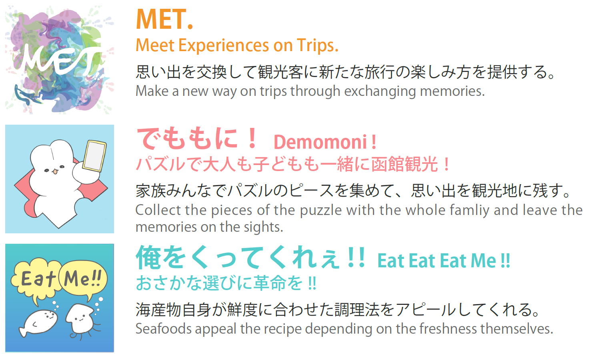

# ビーコンIoTで函館のまちをハックする - Beacon FUN 4

## 紹介動画

    <iframe src="https://www.youtube.com/embed/s91rVjF6vxQ" frameborder="0" allow="accelerometer; autoplay; clipboard-write; encrypted-media; gyroscope; picture-in-picture" allowfullscreen></iframe>

<a href="https://twitter.com/intent/tweet?button_hashtag=BF4最終発表&ref_src=twsrc%5Etfw" class="twitter-hashtag-button" data-show-count="false">Tweet #BF4最終発表</a>
 

## 目的

ビーコンを函館のまちの様々な場所に設置し、ビーコンを活用したサービスを開発する。それによって、新たな価値を生み出し、利用者にこれまでにない体験や魅力を提供することが目的である。
> The purpose is to create new value and provide people unique experiences and attractions. We Install beacons in Hakodate real downtown, and develop services that utilize beacons. 
 

## ビーコンの特徴

- スマートフォンで受信可能なBluetoothで通信を行う小さなデバイス
> Beacon is a small device that communicate via Bluetooth which can be received by smartphones

- バッテリー消費の少ないBLE (Bluetooth Low Energy) を採用
> The devices uses BLE (Bluetooth Low Energy) which is low battery consumption

- ビーコンから受信端末までの距離の計測、個体の識別が可能
> The device is able to measure distance between it and the receiver, identify individual devices
 

## 活動内容

 

## サービス

<a href="https://beaconfun4.github.io/Final-Movie/image/service.png">
  

    
  

</a>
 

